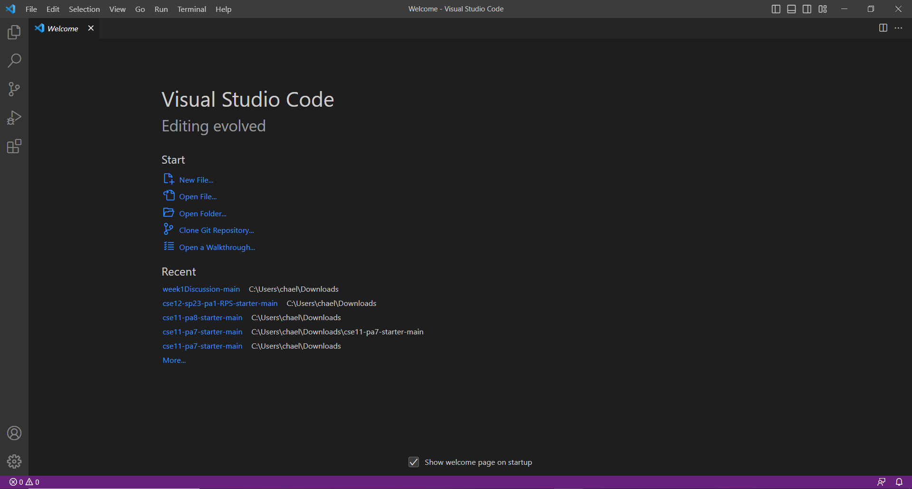

**Installing VScode**
- Go to the VScode website https://code.visualstudio.com/ and follow the directions for Windows or macOS/apple.
- During lab, I skipped this step because I already had VScode installed.
- When you open it, it should look something like the screenshot below. As you can see, under the “Recent” title, I’ve used VScode and opened files on it before.

**Remotely Connecting**
- If you’re on Windows, you must install Git on https://gitforwindows.org/ 
- Once you’ve installed it, open the terminal. If you see green and purple text, it means you’re on the git bash terminal and you’re good to go onto the next step. If not, click on the down arrow next to the plus sign at the top right corner of the terminal window and select Git Bash.
- Now, type in `ssh cs15lsp23[the two letters of your your course-specific account]@ieng6.ucsd.edu”`. An example can be found in the screenshot below.
- If you’re connecting for the first time, you may be faced with something that says “Are you sure you want to continue connecting (yes/no/[fingerprint])?” Just type in “yes” and hit enter.
- Then, it’s going to ask you for your password. Type in your password like normal, even if you don’t see anything appear. It’s supposed to do that. 
- Once you’ve done all this, the following screenshot should be similar to what’s on your screen right now. If you’ve input your password wrong once or more, it will first tell you how many attempts you’ve had. (On my first time setting this up, I had 16 failed attempts haha!). 

**Trying Some Commands**
- Finally, try out some commands
- Examples and expected output can be found in the screenshot below

