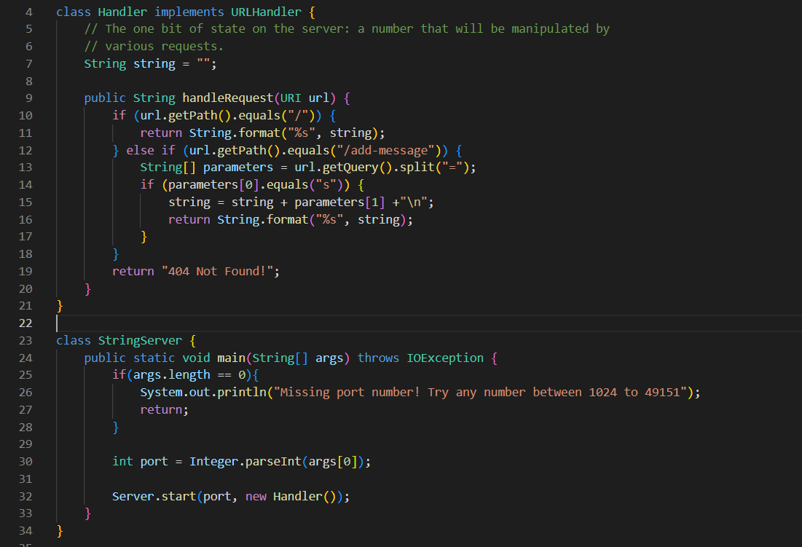
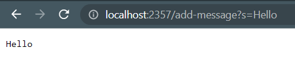
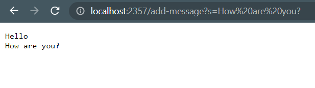
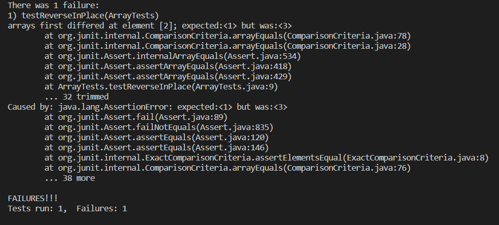

**Part 1**

Code:


Screenshot 1:



Methods called: 
- `getPath()`
- `equals()`
- `getQuery()`
- `split()`
- `format()`

Relevant arguments:
- “/” for `url.getPath().equals(“/”)`
- “/add-message” for `url.getPath().equals(“/add-message”)`
- “=” for `url.getQuery().split(“=”)`
- “s” for `parameters[0].equals(“s”)`
- “%s” and string for `String.format(“%s”, string)`

Values of relevant fields:
- string = “” + “Hello” + “\n”
- url = new URI(“http://localhost:2357/add-message?s=Hello”)
- parameters[0] = “s”
- parameters = {“s”, “Hello”}

Value changes:
- string was initially “” but changed to “Hello\n” after this request

Screenshot 2:



Methods and relevant arguments are the same as the first request.

Values of relevant fields:
- string = “Hello\n” + “How are you?” + “\n”
- url = new URI(“http://localhost:2357/add-message?s=How%20are%20you?”)
- parameters[0] = “s”
- parameters = {“s”, “How are you?”}

Value changes:
- String was initially “Hello\n” but changed to “Hello\nHow are you?\n” after this request


**Part 2**

There was a bug in the method reverseInPlace.

A failure inducing input for the buggy program: 
```
int[] ints = { 1, 2, 3 }; 
ArrayExamples.reverseInPlace(ints); 
assertArrayEquals(new int[]{ 3, 2, 1 }, ints);
```


An input that doesn’t induce a failure:
```
int[] oneInt = { 1 }; 
ArrayExamples.reverseInPlace(oneInt); 
assertArrayEquals(new int[]{ 1 }, oneInt);
```


The symptom:



The bug before:
```
static void reverseInPlace(int[] arr) {
    for(int i = 0; i < arr.length; i += 1) {
      arr[i] = arr[arr.length - i - 1];
    }
  }
  ```


The bug fixed:
```
static void reverseInPlace(int[] arr) {
    for(int i = 0; i < arr.length/2; i += 1) {
      arr[i] = arr[arr.length - i - 1];
    }
  }
  ```


The bug for reverseInPlace was that it iterates the entire array when it should only do half. Halfway through, the method has already completed switching the elements left and right. By continuing further, it undoes it. To fix this, I put “/2” after “arr.length” in the second line so that the loop only goes through half.

**Part 3**

Something I learned from lab in week two was how to create a web server. I didn't know that you could access the website from different computers or keep it local. 
