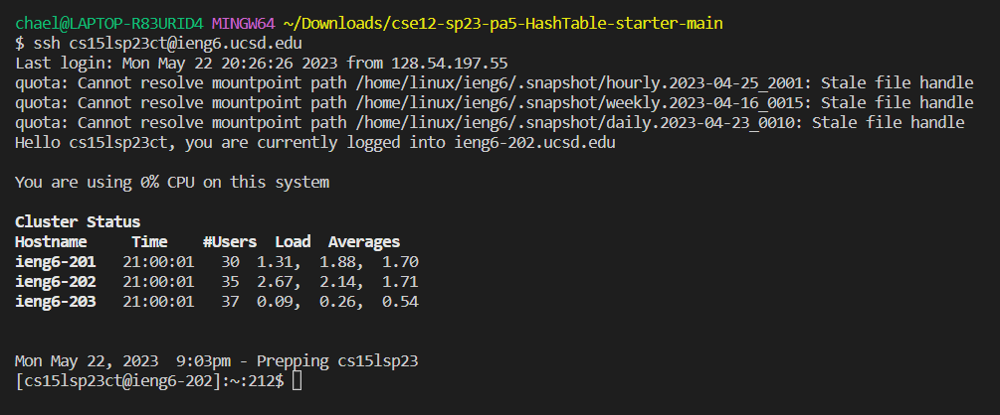
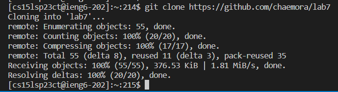

4. Keys Pressed: `<Up><Enter>`

I had already typed in the command previously, so it popped up after I hit the up arrow.

5. Keys Pressed: `<Up><Up><Up><Up><enter>`

I had already typed in the command previously as well, so it popped up after I hit the up arrow four times.

6. `cd<space>lab7<enter><up><up><enter>`
