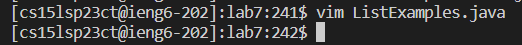
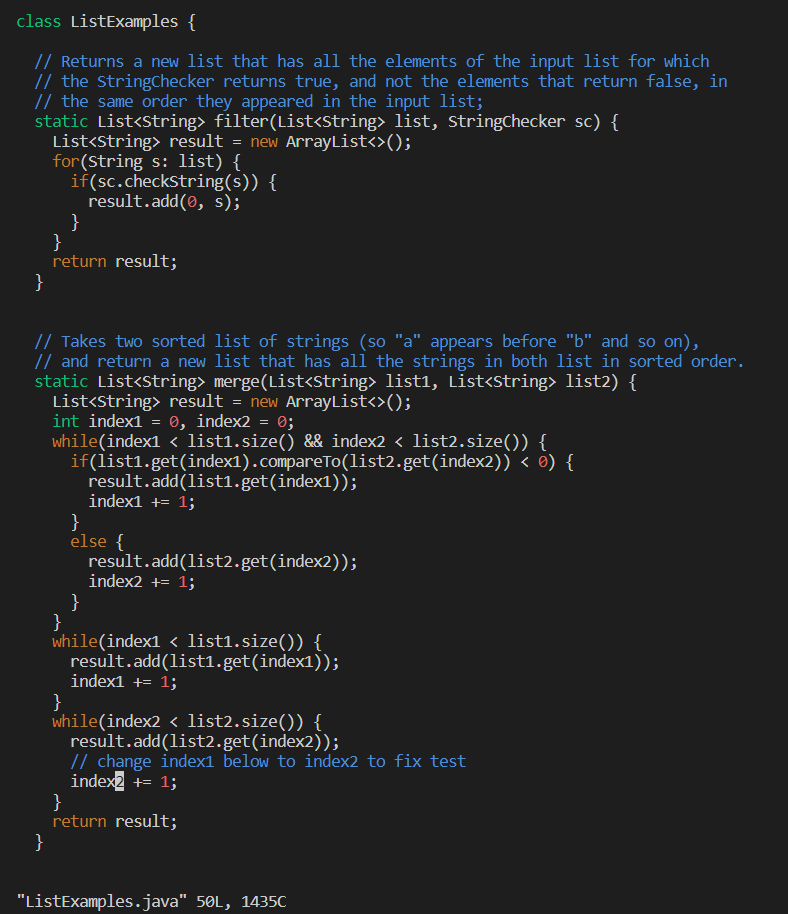
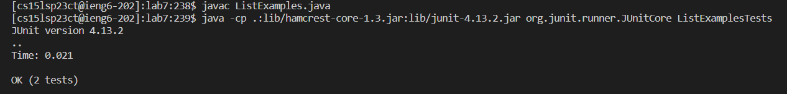
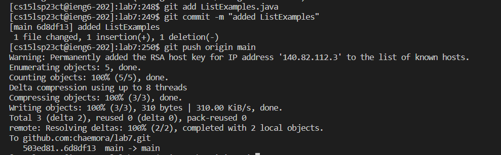

Keys Pressed: `<Up><Enter>`

I had already typed in the command previously, so it popped up after I hit the up arrow.

Keys Pressed: `<Up><Up><Up><Up><enter>`

I had already typed in the command previously as well, so it popped up after I hit the up arrow four times.

Keys Pressed:`cd<space>lab7<enter>` to change directory, `javac<space>ListExamples.java` to compile ListExamples, `<up><up><up><up><up><up><up><enter>` to go into my history for the command to compile ListExamplesTests, `<up><up><up><up><up><up><up><enter>` to run ListExamplesTests.

Keys Pressed: `vim<space>ListExamples.java` to edit ListExamples.java from the terminal, `r2` to replace the 1 in index1 on the 42nd line to 2 (the cursor already landed on the right spot so I didn't need to move it), `:wq` to save changes and quit. 

Keys Pressed: `<up><up><up><enter>` to re-enter the `javac ListExamples.java` command, `<up><up><up><up><up><up><up><up><up><enter>` to re-enter the `java -cp .:lib/hamcrest-core-1.3.jar:lib/junit-4.13.2.jar org.junit.runner.JUnitCore ListExamplesTests` command.

Keys Pressed: `git<space>add<space>ListExamples.java<enter>git<space>commit<space>-m<space>"added<space>ListExamples"` to commit, `git<space>push<space>origin<space>main` to push. I didn't finish the lab so I had to type these out manually.

