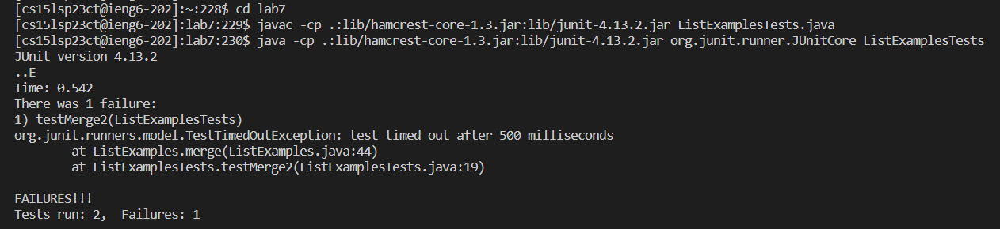

4. Keys Pressed: `<Up><Enter>`

I had already typed in the command previously, so it popped up after I hit the up arrow.

5. Keys Pressed: `<Up><Up><Up><Up><enter>`

I had already typed in the command previously as well, so it popped up after I hit the up arrow four times.

6. Keys Pressed:`cd<space>lab7<enter>` to change directory, `javac<space>ListExamples.java` to compile ListExamples, `<up><up><up><up><up><up><up><enter>` to go into my history for the command to compile ListExamplesTests, `<up><up><up><up><up><up><up><enter>` to run ListExamplesTests.
