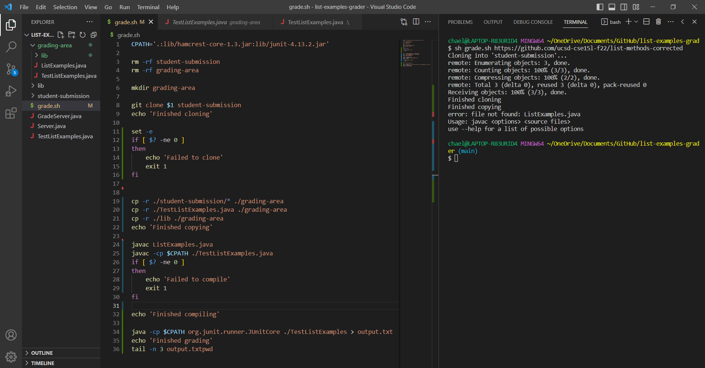
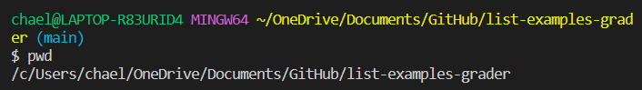

# Part 1 - Debugging Scenario

### 1. Original student post
**What environment are you using (computer, operating system, web browser, terminal/editor, and so on)?**

VSCode Terminal on Windows

**Detail the symptom you're seeing. Be specific; include both what you're seeing and what you expected to see instead. Screenshots are great, copy-pasted terminal output is also great. Avoid saying “it doesn't work”.**

I'm expecting to see the results (like the tests either passing or not passing) from running TestListExamples.java, but I'm getting "error: file not found: ListExamples.java" even though ListExamples.java is in grading-area.

**Detail the failure-inducing input and context. That might mean any or all of the command you're running, a test case, command-line arguments, working directory, even the last few commands you ran. Do your best to provide as much context as you can.**

For context, I tried to write code in the bash file that will copy files into the grading-area and run them so that they can be graded. I tried the same command "sh grade.sh" with other links, but they come up with the same error every time.

### 2. TA Response

Thank you for the detail in your question. If the file cannot be found, is it because it isn't in your current working directory? It may exist, but in a directory you aren't currently in.

### 3. Fixing the bug

By using the pwd command, the student realizes that they aren't in the right directory to run the tests (grading-area). The bug is that grade.sh doesn't change directories to grading-area.

### 4. Setup

This is what was inside TestListExamples.java.

ListExamples.java varies depending on the submission, but this is what https://github.com/ucsd-cse15l-f22/list-methods-corrected (the one used in the first screenshot) looks like.

